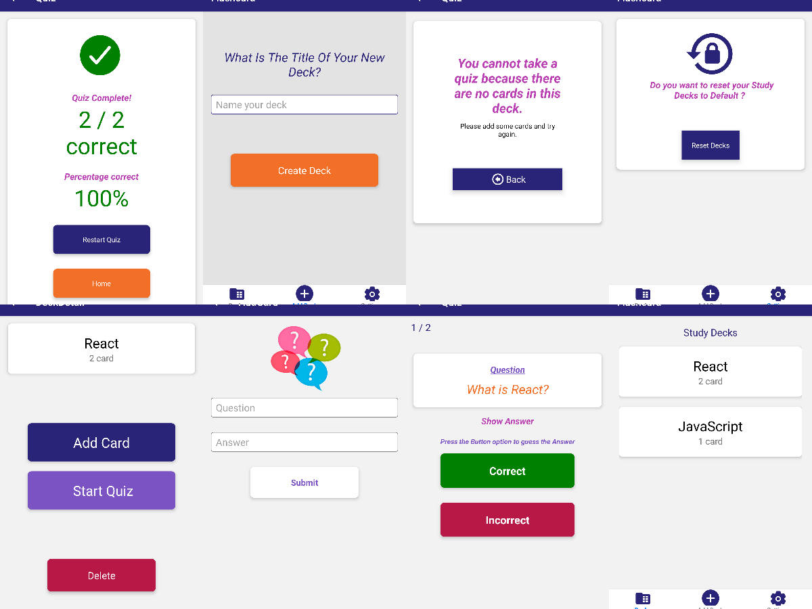

# Mobile Flashcards

Mobile Flashcards is a React Native app for iOS and Android that allows users to create decks, add cards and quiz themselves.



It uses React Native, Expo v43 (latest at this time), Redux, & React Navigations V6x, PagerView ,

This app is the third of three projects required for [Udacity's React Nanodegree program](https://www.udacity.com/course/react-nanodegree--nd019).

- Live Demo: [Mobile Flashcards on Expo](https://expo.dev/@precioussoul/mobile_flashcard)

## Installation

Clone the repository, change directories, and use npm or yarn to install the dependencies.

```bash
$ git clone https://github.com/Precioussoul/Mobile_Flashcard_ND3.git
$ cd mobile_flashcards
$ yarn
```

## Usage

The project can be run with npm or yarn

- `yarn start`

This will open Expo Developer Tools in the browser. You can then do one of the following.

- Use your device to test:

  Scan the QR Code using the Expo Client app ([Expo Client for Android & iOS](https://expo.dev/@precioussoul/mobile_flashcard)) from an Android or iOS device.

- Use an Android Emulator or iOS Simulator to run the app:
  - [iOS Simulator Setup](https://docs.expo.dev/get-started/installation/)
  - [Android Emulator Setup](https://docs.expo.dev/get-started/installation/)

## Testing

This project has been tested on the following platforms:

- Android 11+.
